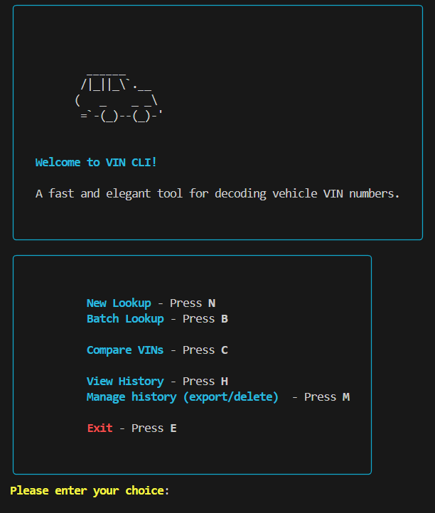

<!DOCTYPE html>
<html lang="en">
<head>
<meta charset="UTF-8">
<meta name="viewport" content="width=device-width, initial-scale=1.0">
</head>
<body>

<h1>VIN CLI 🚗</h1>

A fast and elegant <strong>command-line interface (CLI)</strong> tool for decoding, comparing, and managing <strong>Vehicle Identification Numbers (VINs)</strong>.

<h2>Features ✨</h2>
<ul>
    <li><strong>Single VIN Lookup</strong> – Enter a VIN to retrieve detailed vehicle info.</li>
    <li><strong>Batch VIN Lookup</strong> – Process multiple VINs from a file with optional export.</li>
    <li><strong>VIN Comparison</strong> – Compare two VINs side by side and highlight differences.</li>
    <li><strong>History Management</strong>
        <ul>
            <li>View, delete, or clear previous lookups.</li>
            <li>Export history as PDF, Excel, or TXT.</li>
        </ul>
    </li>
    <li><strong>Flexible Data Exports</strong>
        <ul>
            <li>Single VIN: TXT or PDF.</li>
            <li>Batch VINs: TXT, PDF, or Excel.</li>
            <li>VIN Comparison: TXT, PDF, or Excel with differences highlighted.</li>
        </ul>
    </li>
    <li><strong>Robust Validation & Retry</strong>
        <ul>
            <li>VIN format validation (17 characters, no I/O/Q).</li>
            <li>Automatic retry logic with exponential backoff for API requests.</li>
        </ul>
    </li>
</ul>

<h2>Installation 🛠️</h2>
<pre><code>git clone &lt;repository_url&gt;
cd vin-cli
pip install -r requirements.txt</code></pre>

<strong>Dependencies:</strong> <code>requests</code>, <code>rich</code>, <code>pandas</code>, <code>openpyxl</code>, <code>reportlab</code>

<h2>Usage 🚦</h2>
<pre><code>python __main__.py</code></pre>

<h3>Welcome Screen</h3>
<pre>
    ______
   /|_||_\`.__
  (   _    _ _\
   =`-(_)--(_)-'

Welcome to VIN CLI!
A fast and elegant tool for decoding vehicle VIN numbers.
</pre>

<h3>Main Menu</h3>
<table>
<tr><th>Key</th><th>Action</th></tr>
<tr><td>N</td><td>New VIN Lookup</td></tr>
<tr><td>B</td><td>Batch VIN Lookup</td></tr>
<tr><td>C</td><td>Compare VINs</td></tr>
<tr><td>H</td><td>View History</td></tr>
<tr><td>M</td><td>Manage History (export/delete)</td></tr>
<tr><td>E</td><td>Exit CLI</td></tr>
</table>

<h3>After Lookup Options</h3>
<table>
<tr><th>Key</th><th>Action</th></tr>
<tr><td>D</td><td>Export TXT</td></tr>
<tr><td>P</td><td>Export PDF</td></tr>
<tr><td>S</td><td>Show data again</td></tr>
<tr><td>N</td><td>New Lookup / Main Menu</td></tr>
<tr><td>E</td><td>Exit</td></tr>
</table>

<h2>Example Usage 💻</h2>
<h3>Single VIN Lookup</h3>
<pre><code>Enter VIN number: 1HGCM82633A004352
[Displays vehicle data in a table]
Export TXT? Y/N</code></pre>

<h3>Batch VIN Lookup</h3>
<pre><code>Enter path to VIN file: vins.txt
Processing 10 VINs...
Export results? TXT / PDF / Excel / Skip</code></pre>

<h3>VIN Comparison</h3>
<pre><code>Enter first VIN: 1HGCM82633A004352
Enter second VIN: 1HGCM82633A004353
[Displays side-by-side comparison table]
Export comparison? TXT / PDF / Excel / Skip</code></pre>

<h2>History Management 📜</h2>
<ul>
<li>View previous VIN lookups</li>
<li>Delete single entries</li>
<li>Clear all history</li>
<li>Export history in TXT, PDF, or Excel</li>
</ul>

<h2>Logging 📝</h2>

All actions, warnings, and errors are logged via <code>log.py</code> for easy troubleshooting and tracking.

<h2>File Structure 📂</h2>
<pre><code>vin-cli/
├─ api.py             # VIN validation & API requests
├─ inputs.py          # CLI prompts & menu navigation
├─ display.py         # Display VIN data, comparisons, and history
├─ exports.py         # Export reports (single, batch, comparison)
├─ manageHistory.py   # Manage history entries
├─ historyUtils.py    # Save/load VIN lookups to cache/history
├─ log.py             # Logging utilities
└─ requirements.txt   # Dependencies</code></pre>

<h2>Contributing 🤝</h2>
<pre><code>git checkout -b feature/my-feature
git commit -am "Add feature"
git push origin feature/my-feature
</code></pre>

Then open a pull request.

<h2>License ⚖️</h2>

MIT License

</body>
</html>
